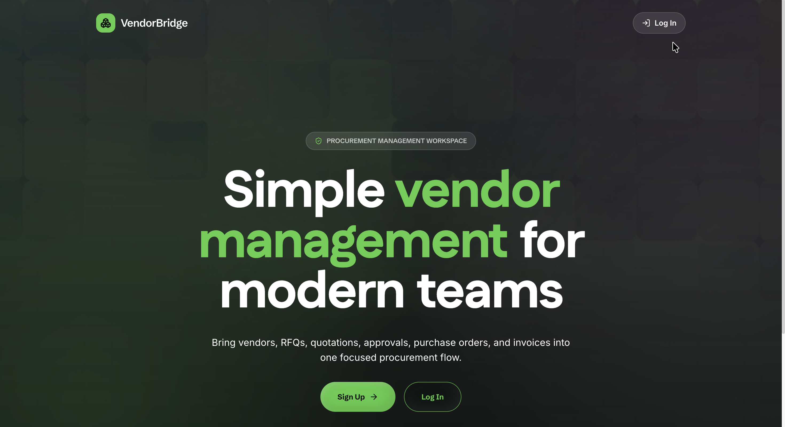

# VendorBridge



VendorBridge is a modern, full-stack Procurement and Vendor Management System. It streamlines the entire supply chain workflow, from managing vendors and initiating Requests for Quotation (RFQs) to handling purchase orders, invoices, and multi-level approvals.

## 🌟 Features

- **Vendor Management:** Onboard, evaluate, and manage vendor details and compliance efficiently.
- **Request for Quotation (RFQ):** Create RFQs and broadcast them to relevant vendors.
- **Quotation Comparison:** Collect vendor bids, analyze them side-by-side, and make data-driven decisions.
- **Purchase Orders (PO):** Generate and track purchase orders with automated status updates.
- **Invoice Tracking:** Manage vendor invoices and track payments.
- **Approval Workflows:** Multi-level approval mechanisms for RFQs, POs, and Invoices.
- **Real-time Notifications:** In-app notifications and email alerts to keep all stakeholders updated.
- **Comprehensive Dashboards & Reports:** Interactive charts (via Recharts) providing insights into procurement activities.
- **Role-Based Access Control (RBAC):** Secure access tailored for Admins, Managers, and Staff.

## 🛠️ Tech Stack

### Frontend
- **Framework:** React 19 with Vite
- **Styling:** Tailwind CSS, Radix UI Primitives, Framer Motion
- **State Management:** Zustand, TanStack React Query
- **Routing:** React Router DOM v7
- **Forms & Validation:** React Hook Form, Zod
- **Data Visualization:** Recharts, TanStack Table
- **PDF Generation:** React PDF Renderer

### Backend
- **Runtime:** Node.js, Express
- **Database & Auth:** Supabase (PostgreSQL, Supabase Auth)
- **Security:** Helmet, Express Rate Limit, CORS
- **Validation:** Zod
- **Email Service:** Nodemailer (with Google APIs)
- **PDF Generation:** Puppeteer
- **File Uploads:** Multer

## 🚀 Getting Started

### Prerequisites
- Node.js (v18 or higher recommended)
- Supabase Project (Database and Authentication configured)

### 1. Clone the repository

```bash
git clone https://github.com/your-username/ODOO_Glyphcoders.git
cd ODOO_Glyphcoders/vendorbridge
```

### 2. Backend Setup

1. Navigate to the backend directory:
   ```bash
   cd backend
   ```
2. Install dependencies:
   ```bash
   npm install
   ```
3. Create a `.env` file in the `backend` directory based on your configuration requirements. You will likely need:
   ```env
   PORT=5000
   SUPABASE_URL=your_supabase_project_url
   SUPABASE_SERVICE_KEY=your_supabase_service_role_key
   # Add other required environment variables (e.g., SMTP configurations for Nodemailer)
   ```
4. Start the backend development server:
   ```bash
   npm run dev
   ```

### 3. Frontend Setup

1. Open a new terminal and navigate to the frontend directory:
   ```bash
   cd vendorbridge/frontend
   ```
2. Install dependencies:
   ```bash
   npm install
   ```
3. Create a `.env` file in the `frontend` directory:
   ```env
   VITE_SUPABASE_URL=your_supabase_project_url
   VITE_SUPABASE_ANON_KEY=your_supabase_anon_key
   VITE_API_URL=http://localhost:5000/api
   ```
4. Start the frontend development server:
   ```bash
   npm run dev
   ```

### 4. Database Seeding (Optional)

You can seed initial users or roles using the provided seed script in the backend directory.
```bash
cd vendorbridge/backend
node seed-users.js
```

## 📁 Project Structure

```
vendorbridge/
├── backend/                # Node.js + Express API
│   ├── src/
│   │   ├── config/         # Supabase and app configuration
│   │   ├── controllers/    # Route controllers (Vendors, RFQ, POs, etc.)
│   │   ├── middleware/     # Auth, RBAC, Validation
│   │   ├── routes/         # API Routes
│   │   ├── services/       # Email, PDF services
│   │   └── utils/          # Helpers (Logging, Notifications)
│   └── server.js           # Entry point
│
└── frontend/               # React + Vite application
    ├── src/
    │   ├── components/     # Reusable UI components and layouts
    │   ├── hooks/          # Custom React hooks (useRBAC, useNotifications)
    │   ├── lib/            # Axios API config, Supabase client
    │   ├── pages/          # Full-page components
    │   ├── routes/         # Protected route configurations
    │   └── store/          # Zustand global stores
    └── index.html          # HTML template
```

## 📜 License

This project is licensed under the MIT License.
